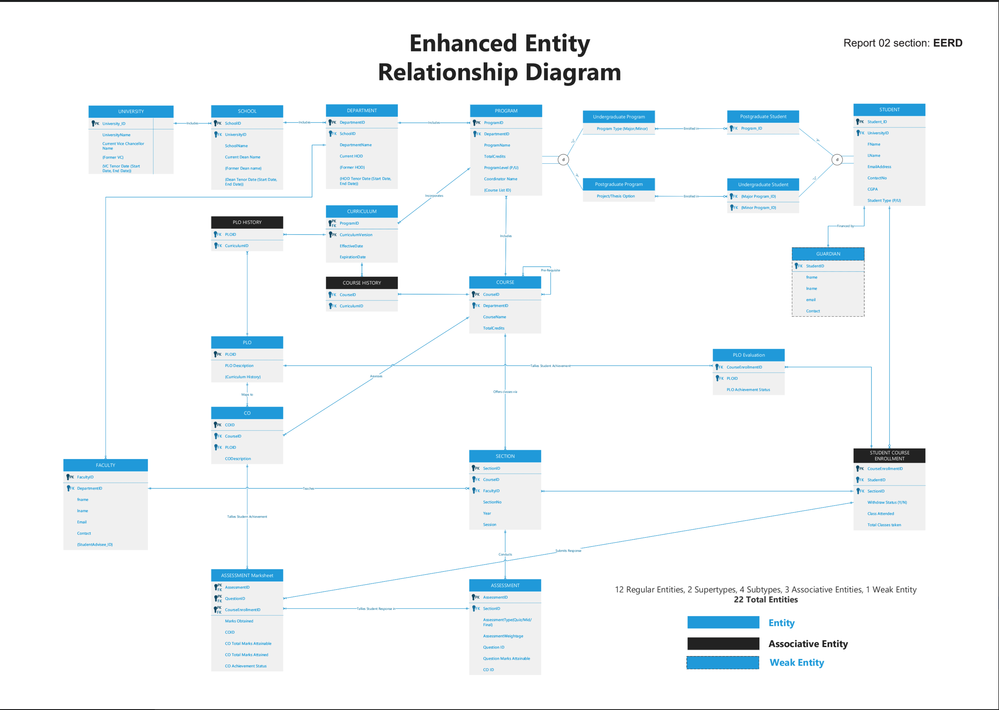

# Student Performance Monitor (SPM) 2021

## Overview

This project was developed as part of the undergraduate database management course. The primary goal was to design a robust forward-engineered database for an upgraded Student Performance Monitor (SPM).

### Background

The upgraded SPM is designed with comprehensiveness and scalability, allowing real-time tracking of students' performance within historical timeframes. The user-friendly interface caters to various stakeholders, including students, faculties, higher management, and parents. The project's objective is to bring positive impactful changes to the education sector, making information accessible and empowering users to gain insightful feedback.

### Project Details

- **Database Design:** The project focuses on a solid and robust forward-engineered database.
- **Technology Stack:** Django, MySQL, HTML, CSS, and Google Charts for generating charts.
- **ORM Usage:** The project does not use ORM and relies solely on custom SQL queries.

## Project Components

### Entity Relationship Diagram (ERD)

### Final Report

- [Download PDF](Final%20report%20v1.0.pdf)

### UI Screenshots

## Getting Started

- Clone the repository.
- Install the required dependencies.
- Configure the Django settings.
- Run the application.
